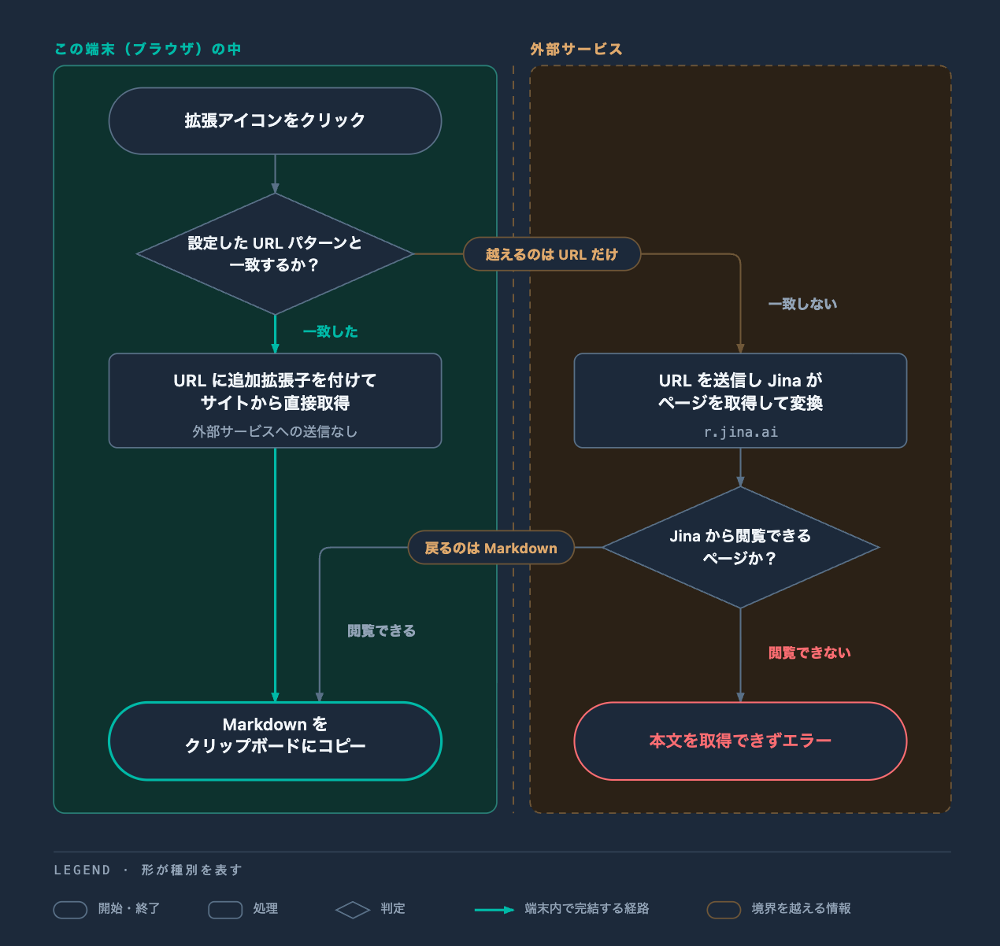

# copy-md

開いているページの内容を Markdown として取得し、クリップボードにコピーする Chrome 拡張。

## セットアップ

サービスから直接 Markdown を取得できるサイト以外のページは Jina AI Reader を経由するため、
API キーの設定が必要。

1. [https://jina.ai/](https://jina.ai/) で `jina_` から始まる API キーを取得する
2. ツールバーの拡張アイコンを**右クリック**して「オプション」を選ぶ
3. キーを貼り付ける（入力が止まると自動で保存される）

設定は `chrome.storage.local` にこの端末のみで保存される。

## Markdown を取得するまでの流れ

「直接取得するサイト」は設定画面の表で追加・削除できる。

## 既知の制限

- Jina AI Reader にはレート制限がある
- ログインが必要なページは、「直接取得するサイト」に登録していないと取得できない
- `chrome://` や Chrome ウェブストアなど、Chrome がスクリプト注入を禁止しているページでは動作しない

## プライバシー

どの情報が端末内に留まり、どの情報が外部へ出るかは [PRIVACY.md](PRIVACY.md) に記載している。

## 開発

開発環境の準備と動作確認の手順は [CONTRIBUTING.md](CONTRIBUTING.md) を参照。

## ライセンス

[MIT](LICENSE)
